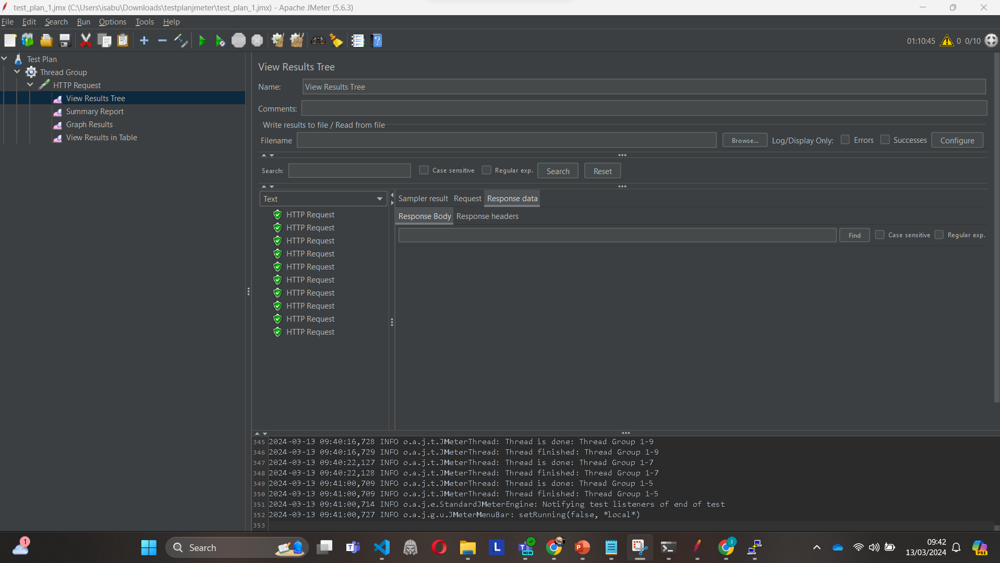
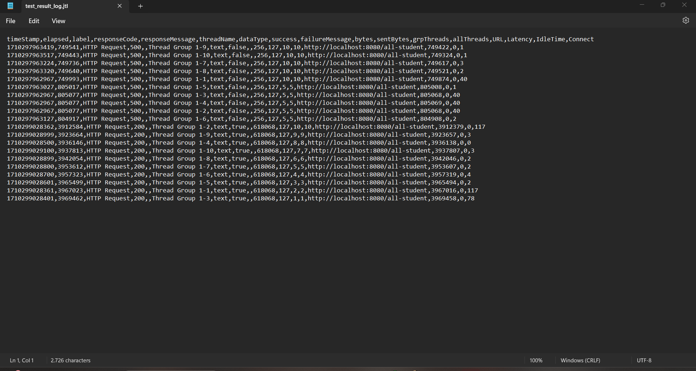
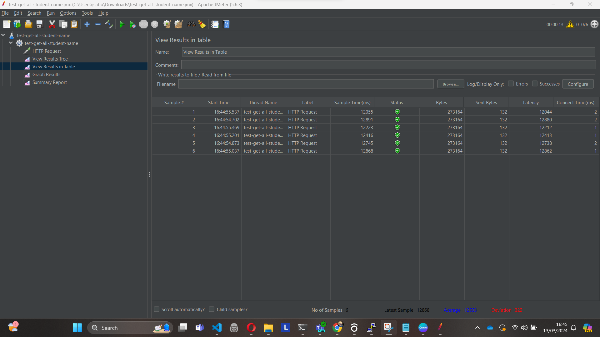
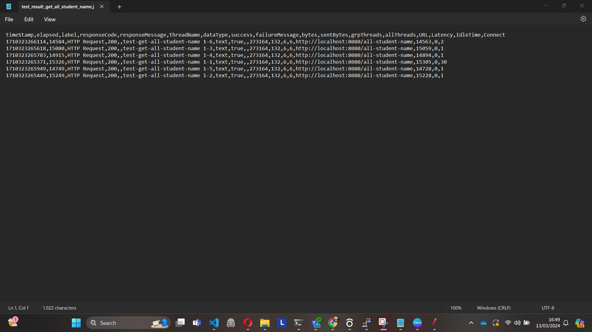
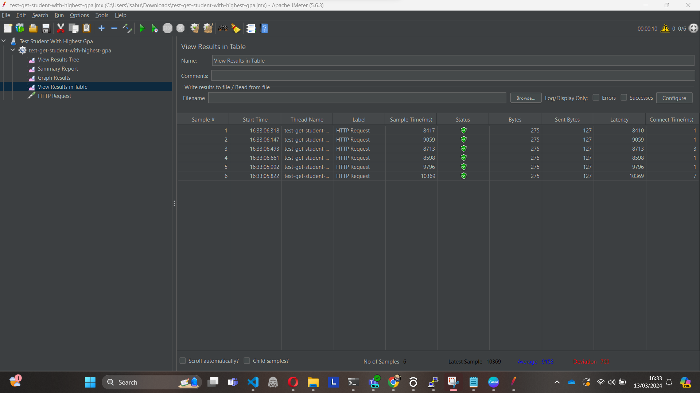

Nama: Isa Citra Buana
NPM: 2206081465
Kelas: Advanced Programming C

Hasil Tes API /all-student melalui GUI

Hasil Tes API /all-student melalui CLI

Hasil Tes API /all-student-name melalui GUI

Hasil Tes API /all-student-name melalui CLI

Hasil Tes API /highest-gpa melalui GUI

Hasil Tes API /highest-gpa melalui CLI

1. Pengujian kinerja dengan JMeter melibatkan simulasi beban pengguna pada aplikasi untuk mengukur kinerjanya dalam berbagai kondisi. JMeter berfokus pada pengukuran metrik 
seperti waktu respons, throughput, dan penggunaan sumber daya. Intinya, semacam load testing. Sementara itu, profilisasi dengan IntelliJ Profiler melibatkan 
analisis perilaku runtime dari aplikasi untuk mengidentifikasi bottleneck kinerja dan area yang perlu dioptimalkan. 
Ini memberikan wawasan tentang waktu eksekusi metode, penggunaan memori, penggunaan CPU, dan aktivitas thread.

2. Profilisasi membantu mengidentifikasi area kode yang menggunakan sumber daya terbanyak, seperti CPU, memori, atau operasi I/O.
   Ini memungkinkan Anda untuk menemukan metode atau komponen tertentu yang menyebabkan masalah kinerja. Dengan menganalisis data profilisasi,
   kitadapat memahami di mana optimasi diperlukan dan fokus pada meningkatkan bagian-bagian paling kritis dari aplikasi.

3. Ya tentu saja. Intellij profiler membantu saya mengetahui kode mana yang mengonsumsi resource terbanyak dan berapa latensi kode tersebut.
   
4. Challengenya adalah sulit untuk menyamai kondisi di dunia nyata.  Contohnya  Data yang digunakan dalam pengujian mungkin tidak mewakili data
    yang sebenarnya digunakan oleh pengguna di dunia nyata. Selain itu, beban kerja dalam pengujian mungkin tidak mencakup semua skenario penggunaan yang mungkin terjadi.
   
5. Tahu di bagian kode mana aplikasi kita bottleneck.
   
6. Jika terdapat ketidaksesuaian antara hasil profil dengan IntelliJ Profiler dan pengujian kinerja menggunakan JMeter
   langkah pertama yang saya dilakukan adalah memeriksa pengaturan konfigurasi
 serta parameter yang digunakan dalam kedua alat tersebut untuk memastikan konsistensi. Selanjutnya, saya harus paham cara kerja dan batasan masing-masing alat,
termasuk bagaimana cara mereka mengukur kinerja, menangani konkurensi, dan menafsirkan data. Terakhir, tanya asdos.

7. Refactor kode dengan cara memperbaiki alur code maupun algoritma code. Lalu test lagi. Kalau sudah bagus, berarti pass. Ibaratnya kita manfaatkan konsep TDD yang telah dipelajari
   sebelumnya untuk menguji performa dan memprofil aplikasi kita. 
   
